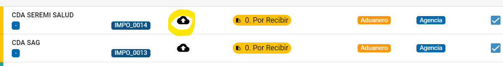

# Certificación SERNAPESCA

### Abreviatura

| SERNAPESCA                            | SP                                     |
| ------------------------------------- | -------------------------------------- |
| CodAut                                | Código de Autorización / Número NEPPEX |
| Solicitud de Certificación SERNAPESCA | SCSP                                   |

### Proceso general de Certificación SERNAPESCA


<mark style="color:orange;">**Advertencia!**</mark>

**Despachos con Vía Marítima**

Una solicitud de certificación SERNAPESCA solo debe iniciarse con **Fecha de Zarpe Efectiva** y con la **instrucción entregada del cliente**.

**Otros Depachos**

Solo requiere la instrucción entregada por parte del Cliente.


<table data-view="cards"><thead><tr><th></th><th></th><th></th></tr></thead><tbody><tr><td><strong>1) Revisión documentos</strong></td><td>Cliente envía documentos (mínimos requeridos BL y Factura)</td><td>Agente Certificador debe clasificar y dar conformidad a los documentos.</td></tr><tr><td><strong>2) Confección borrador</strong></td><td>Robot pre-llena formulario SICEX y notifica a certificador.</td><td>Certificador completa formulario de SICEX y SISCOMEX.</td></tr><tr><td><strong>3) Gestión V°B° del cliente</strong></td><td>Robot obtiene borrador desde SISCOMEX, para luego notificar a cliente.</td><td>Cliente debe enviar comentarios solo en caso de reparos o enviar V°B.</td></tr><tr><td><strong>4) Presentación SP</strong></td><td>Robot notifica y presenta solicitud ante SISCOMEX.</td><td>Genera comprobantes de presentación y almacena en EURUS PRO.</td></tr><tr><td><strong>5) Emisión del certificado</strong></td><td>Robot almacena Certificados en EURUS PRO.</td><td>Notifica a cliente y al certificador.</td></tr></tbody></table>

### Etapas del proceso de certificación

<table><thead><tr><th width="278.3333333333333">Etapa</th><th width="138">Responsable</th><th>Descripción</th></tr></thead><tbody><tr><td><strong>1) Pendiente Zarpe</strong></td><td>Agencia</td><td>Despacho no tiene Fecha Zarpe Efectiva.</td></tr><tr><td><strong>2) Sin Documentos</strong></td><td>Cliente</td><td>Solicitud requiere de documentación.</td></tr><tr><td><strong>3) Documentos Por Revisar</strong></td><td>Agencia</td><td>Documentos no han sido revisados por certificador.</td></tr><tr><td><strong>4) Documentos Incompletos</strong></td><td>Agencia</td><td>Documentos enviados por Cliente no son correctos o están incompletos.</td></tr><tr><td><strong>5) Pendiente Clave CodAut</strong></td><td>Cliente</td><td>Cliente no ha enviado Clave CodAut.</td></tr><tr><td><strong>6) Pendiente Número RUCE</strong></td><td>Agencia</td><td>Despacho no tiene definido número RUCE - Se obtiene desde SIGAD.</td></tr><tr><td><strong>7) Solicitando Evaluación SP SICEX</strong></td><td>Agencia</td><td>Robot de EURUS hace prellenado de datos en SICEX.</td></tr><tr><td><strong>8) Por Completar Evaluación SP en SICEX</strong></td><td>Agencia</td><td>Certificador debe ir a SICEX y terminar de llenar o completar formulario de solicitud de evaluación.</td></tr><tr><td><strong>9) Pendiente Conformidad Evaluación SP en SICEX</strong></td><td>Agencia</td><td>Robot de EURUS está a la espera de que SP emita conformidad en SICEX</td></tr><tr><td><strong>10) Borrador en Confección</strong></td><td>Agencia</td><td>Certificador debe iniciar el proceso de llenado de solicitud SP en SISCOMEX.</td></tr><tr><td><strong>11) Borrador en V°B°</strong></td><td>Cliente</td><td>Cliente debe dar V°B del borrador generado en SISCOMEX.</td></tr><tr><td><strong>12) Borrador Aprobado Cliente</strong></td><td>Agencia</td><td>Cliente dio V°B° positivo del borrador.</td></tr><tr><td><strong>13) Presentado SISCOMEX</strong></td><td>Agencia</td><td>Robot notifica y solicita generación de Certificado ante SP en SISCOMEX.</td></tr><tr><td><strong>14) Certificado Emitido</strong></td><td>Agencia</td><td>SP emitió un certificado para el NEPPEX o CodAut solicitado, robot de EURUS almacena certificado en EURUS PRO.</td></tr><tr><td></td><td></td><td></td></tr></tbody></table>

### Cómo anular una solicitud ante SICEX

En ocasiones, será necesario volver a presentar una solicitud de evaluación ante SP a través del sitio de SICEX, para ello, debe ejecutar el siguiente procedimiento:

* Abra el registro de SCSP en EURUS PRO.
*   Abra la Ficha (TAB) llamada ESTADO SICEX&#x20;

    <figure><figcaption>
Formulario de SCSP
</figcaption></figure>
* Haga clic en el registro que esté activo y luego marque o seleccione la opción que dice "Anular Evaluación en SICEX"

<figure><figcaption>
Formulario de una solicitud de evaluación ante SP
</figcaption></figure>

* Aguarde de 1 a 3 minutos, para que el sistema vuelva a realizar la solicitud.

## Finalización Manual

La finalización manual se aplica en los siguientes casos:

1. Cuando cliente solicita no certificar o la certificación es realizada por tercero.
2. Cuando a criterio operacional o por cambio de ley, se debe "anular" un proceso de certificación.

### Cómo aplicar el estado "No Aplica"

1. Busca la solicitud que esté en curso.
2. Agrega un motivo y/o razón por la que se debe asignar el estado **No Aplica**.

<figure><figcaption>
Formulario de la Solicitud de Certificación
</figcaption></figure>


<mark style="color:blue;">**Ten presente!**</mark>

Cuando una solicitud está en estado "No Aplica", el sistema no calculará ni definirá indicadores de gestión, así como tampoco se buscará estado ante SICEX y SISCOMEX.


### Cómo revertir el estado "No Aplica"

1. Se debe ir a la vista de "Certificados Anulados/No Aplica",&#x20;
2. Buscar la solicitud y retirar el Motivo de Finalización Manual en formulario.


<mark style="color:blue;">**Ten presente!**</mark>

El sistema recalculará el Estado del Certificado nuevamente, y asignará según corresponda. Esto implica la medición de los indicadores y la consulta ante SICEX y SISCOMEX.


##
